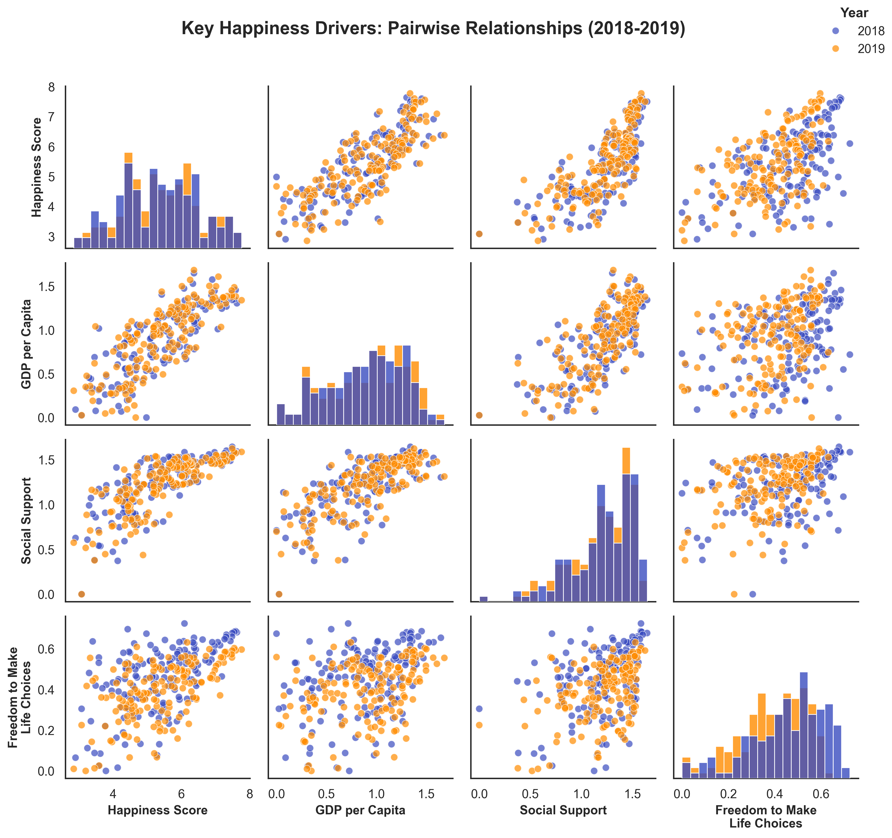

# World Happiness Analysis 🌍😊

An exploratory data analysis of the World Happiness Report focusing on the relationship between economic status and happiness across nations.

## About The Project

### Project Goal
To analyze the World Happiness Report dataset to understand the factors contributing to happiness, specifically focusing on how happiness levels vary across countries with different economic statuses. The aim is to highlight that wealth (GDP per capita) is not the sole determinant of happiness and to identify other significant factors.

### Storyline: "Unequal Happiness: Rich, Poor & Outliers"
This narrative explores the relationship between a country's economic status (GDP per capita) and its happiness score, identifying countries that defy the expected pattern (i.e., happy but poor, or rich but unhappy) and uncovering the underlying factors that explain these "outliers."

### Key Research Questions
1. How strong is the relationship between GDP per capita and the Happiness Score?
   - Establishing the baseline expectation between wealth and happiness

2. Which countries are "happy outliers"?
   - Identifying nations with lower GDP but surprisingly high happiness scores
   - Understanding the factors contributing to their well-being

3. Which countries are "unhappy outliers"?
   - Analyzing nations with high GDP but relatively lower happiness scores
   - Exploring factors that might explain their discontent

4. Beyond GDP, which other factors show the strongest correlation with happiness?
   - Examining the role of social support, freedom, healthy life expectancy
   - Analyzing the impact of generosity and perceptions of corruption
   - Special focus on these factors in the context of outlier countries

### Insights Preview


### Full Report
For a comprehensive analysis and detailed findings, you can view the complete report: [Beyond GDP: Exploring the Factors Behind Happiness](Beyond%20GDP%20Exploring%20the%20Factors%20Behind%20Happiness.pptx.pdf)

## Getting Started
Check [technical_documentation.md](technical_documentation.md) for detailed documentation on:
- Installation requirements
- Project structure
- Dataset description
- Analysis process

## Repository Structure Overview
For a quick overview, the project includes:
- Exploratory Data Analysis (EDA) in Jupyter notebooks
- Visualizations of key findings
- Processed statistics and insights
- Utility functions for data analysis

For detailed technical information about the structure and setup, please refer to the [technical documentation](technical_documentation.md).

## Authors and Acknowledgment

This analysis has been performed by:

- [Ana Gamito](https://www.linkedin.com/in/ana-gamito/)

during the [Allwomen Data Analytics Bootcamp](https://www.allwomen.tech/bootcamp/data-analytics-bootcamp/)

## License

This project is licensed under the MIT License - see the [LICENSE](LICENSE) file for details.

## Data Source

This analysis uses data from the [World Happiness Report](https://www.worldhappiness.report/), which is a landmark survey of the state of global happiness that ranks 156 countries by how happy their citizens perceive themselves to be. For more information about the methodology and annual reports, visit the [official World Happiness Report website](https://www.worldhappiness.report/).

## Citation

If you use this analysis or the World Happiness Report data, please cite:

```
Helliwell, J. F., Layard, R., Sachs, J. D., De Neve, J.-E., Aknin, L. B., & Wang, S. (Eds.). (2025). World Happiness Report 2025. University of Oxford: Wellbeing Research Centre.
```
